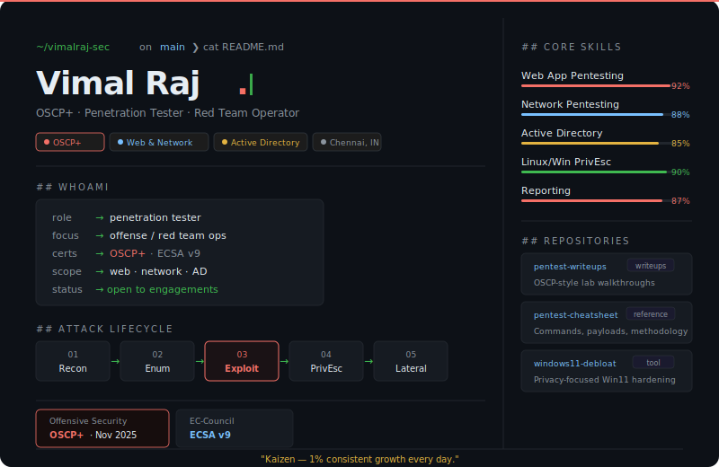

---

## core skills

| Domain | Coverage |
|---|---|
| Web app pentesting | OWASP Top 10, auth flaws, injection, logic bugs |
| Network pentesting | Service enum, misconfigs, exploitation |
| Active Directory | Kerberoasting, Pass-the-Hash, lateral movement |
| Linux / Windows privesc | SUID, unquoted paths, token abuse |
| Reporting | Executive summaries, risk ratings, remediation guidance |

---

## connect

<!--
> “Only two things exist: the known and the unknown. Learn the unknown.”
**vimalraj-sec/vimalraj-sec** is a ✨ _special_ ✨ repository because its `README.md` (this file) appears on your GitHub profile.

Here are some ideas to get you started:

- 🔭 I’m currently working on ...
- 🌱 I’m currently learning ...
- 👯 I’m looking to collaborate on ...
- 🤔 I’m looking for help with ...
- 💬 Ask me about ...
- 📫 How to reach me: ...
- 😄 Pronouns: ...
- ⚡ Fun fact: ...
-->
